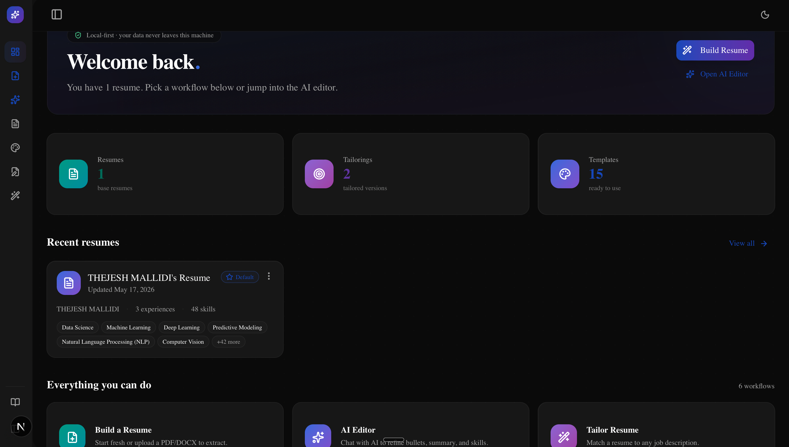
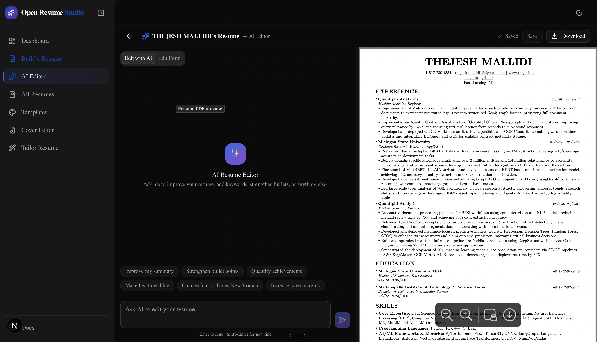
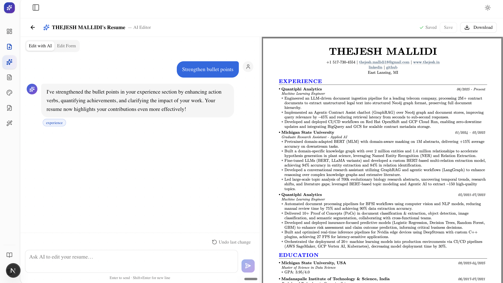
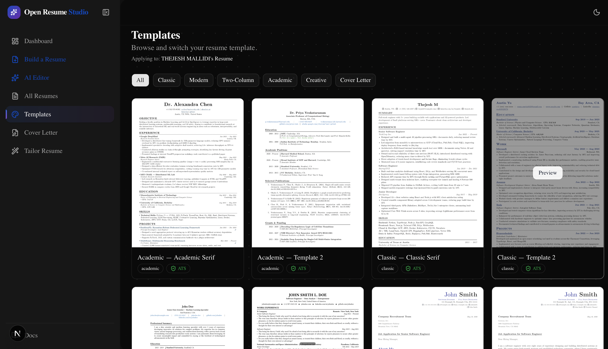

# Resume Studio

Local-first, open-source AI resume workspace. Build, edit, tailor, and write cover letters for resumes — all on your machine, with whichever LLM you choose.

- **Local-first.** SQLite by default, files on disk. No accounts, no cloud, no telemetry.
- **Bring your own model.** Gemini, OpenAI, Anthropic, or a local Ollama model — pick one and go.
- **Open source.** MIT-licensed. Contributions welcome.

## Screenshots

<table>
  <tr>
    <td width="50%" align="center">
      <a href="demo_samples/dashboard.png">
        
      </a>
      <br />
      <sub><b>Dashboard</b> — workspace overview with your resumes, templates, and one-click actions.</sub>
    </td>
    <td width="50%" align="center">
      <a href="demo_samples/ai_editor.png">
        
      </a>
      <br />
      <sub><b>AI Editor</b> — live PDF preview side-by-side with an AI chat for bullets, summaries, and skills.</sub>
    </td>
  </tr>
  <tr>
    <td width="50%" align="center">
      <a href="demo_samples/ai_editing.png">
        
      </a>
      <br />
      <sub><b>Editing with AI</b> — ask in natural language; edits land on the PDF in place.</sub>
    </td>
    <td width="50%" align="center">
      <a href="demo_samples/templates.png">
        
      </a>
      <br />
      <sub><b>Templates</b> — Academic, Classic, Modern, Two-Column, Creative, and Cover Letter styles.</sub>
    </td>
  </tr>
</table>

## Stack

- **Backend** — FastAPI, SQLAlchemy 2 (async), SQLite/Postgres, Typst for PDF compilation
- **Frontend** — Next.js (App Router), React 19, Tailwind v4, TanStack Query
- **AI** — Gemini / OpenAI / Anthropic / Ollama via a small provider abstraction

## Quick start

You need:

- Python 3.12+
- Node 20+
- [Typst](https://typst.app/) on your `PATH` (used to compile resumes to PDF)
- An API key from one of the supported providers, **or** a running [Ollama](https://ollama.com/) instance for fully-offline use

### 1. Clone & install

```bash
git clone https://github.com/<your-fork>/open-resume-studio.git
cd open-resume-studio

# Backend
cd backend
python -m venv .venv && source .venv/bin/activate
pip install -e .

# Frontend
cd ../frontend
npm install
```

### 2. Configure your LLM

Pick one of two ways:

**Option A — shell `export` (recommended for API keys).** Keys never touch disk.

```bash
export LLM_PROVIDER=gemini
export GEMINI_API_KEY=sk-...
./run.sh
```

**Option B — `.env` file.** Copy `backend/.env.example` to `backend/.env` and edit:

```bash
LLM_PROVIDER=gemini
GEMINI_API_KEY=...

# ...or OpenAI
# LLM_PROVIDER=openai
# OPENAI_API_KEY=...

# ...or Anthropic
# LLM_PROVIDER=anthropic
# ANTHROPIC_API_KEY=...

# ...or a local Ollama model (no API key needed)
# LLM_PROVIDER=ollama
# OLLAMA_MODEL=llama3.1
```

Shell env vars always take precedence over `.env`, so you can mix both (e.g. defaults in `.env`, secrets in shell).

### 3. Run

```bash
# From the repo root:
./run.sh
```

That starts the backend on `http://localhost:8000` and the frontend on `http://localhost:3000`.

The first run creates `data/open_resume_studio.db` (SQLite) and `data/storage/` (uploaded files). Delete that folder to start fresh.

## Configuration

Every setting can be passed as a shell env var or kept in `backend/.env`. The interesting ones:

| Variable | Default | Purpose |
| --- | --- | --- |
| `LLM_PROVIDER` | `gemini` | One of `gemini` \| `openai` \| `anthropic` \| `ollama` \| `none` |
| `GEMINI_API_KEY` / `OPENAI_API_KEY` / `ANTHROPIC_API_KEY` | — | Key for the provider you picked |
| `GEMINI_MODEL` / `OPENAI_MODEL` / `ANTHROPIC_MODEL` / `OLLAMA_MODEL` | sensible defaults | Override which model to call |
| `OLLAMA_HOST` | `http://localhost:11434` | Ollama server URL |
| `DATABASE_URL` | `sqlite+aiosqlite:///./data/open_resume_studio.db` | Switch to Postgres by setting `postgresql+asyncpg://...` |
| `STORAGE_DIR` | `./data/storage` | Where uploaded resumes and generated PDFs live |
| `FRONTEND_URL` | `http://localhost:3000` | Used for CORS |

## Contributing

See [CONTRIBUTING.md](./CONTRIBUTING.md). PRs that fix bugs, add providers, add templates, or improve docs are all welcome.

## License

MIT — see [LICENSE](./LICENSE).
